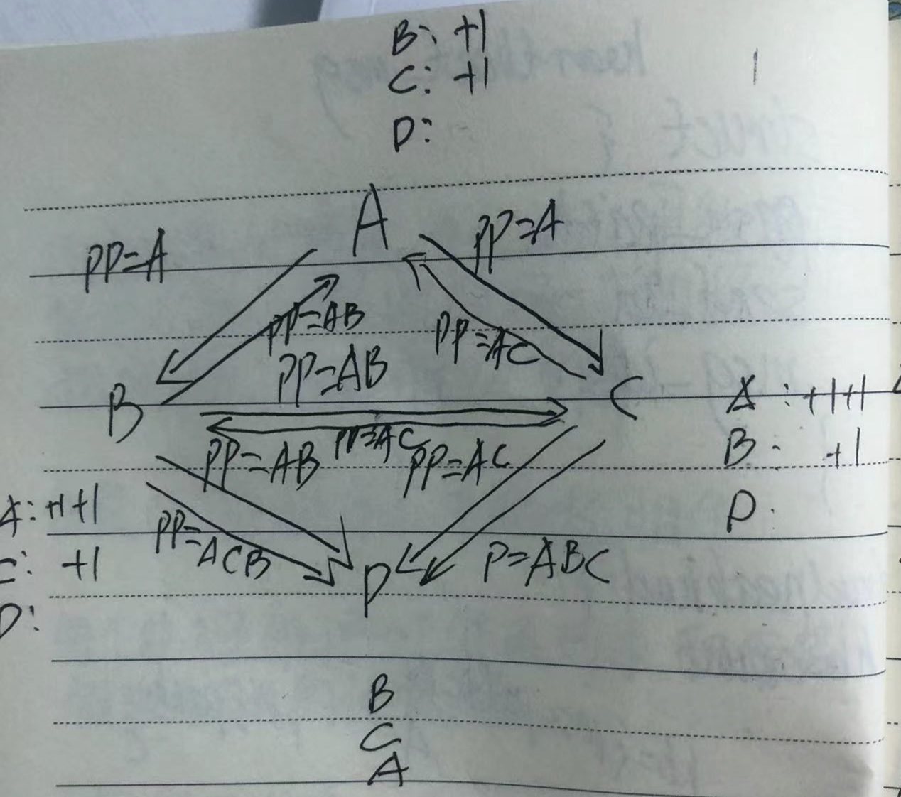
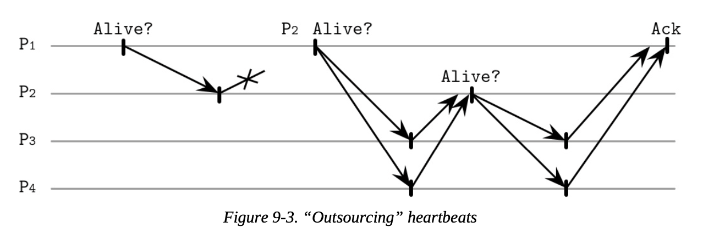
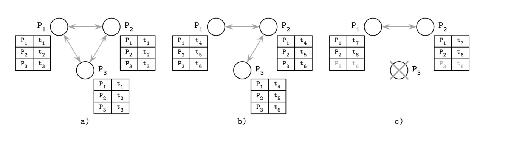
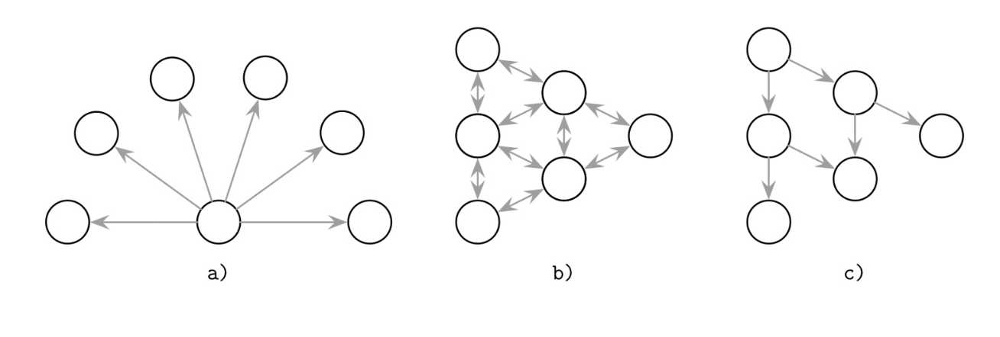
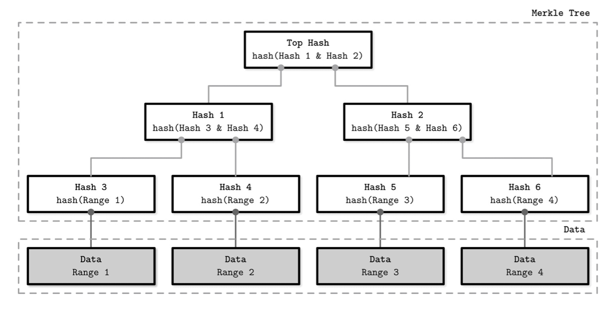
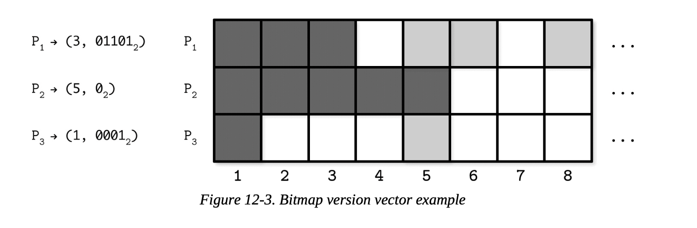
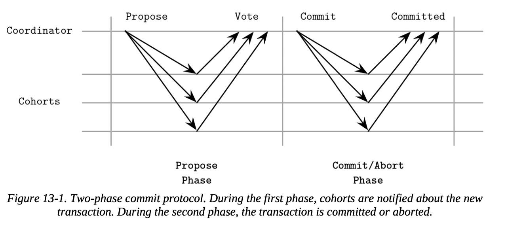
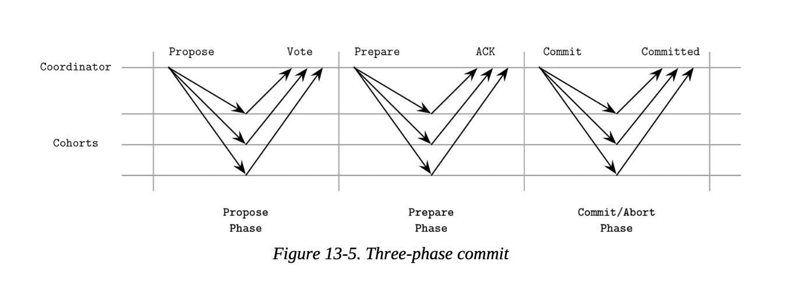
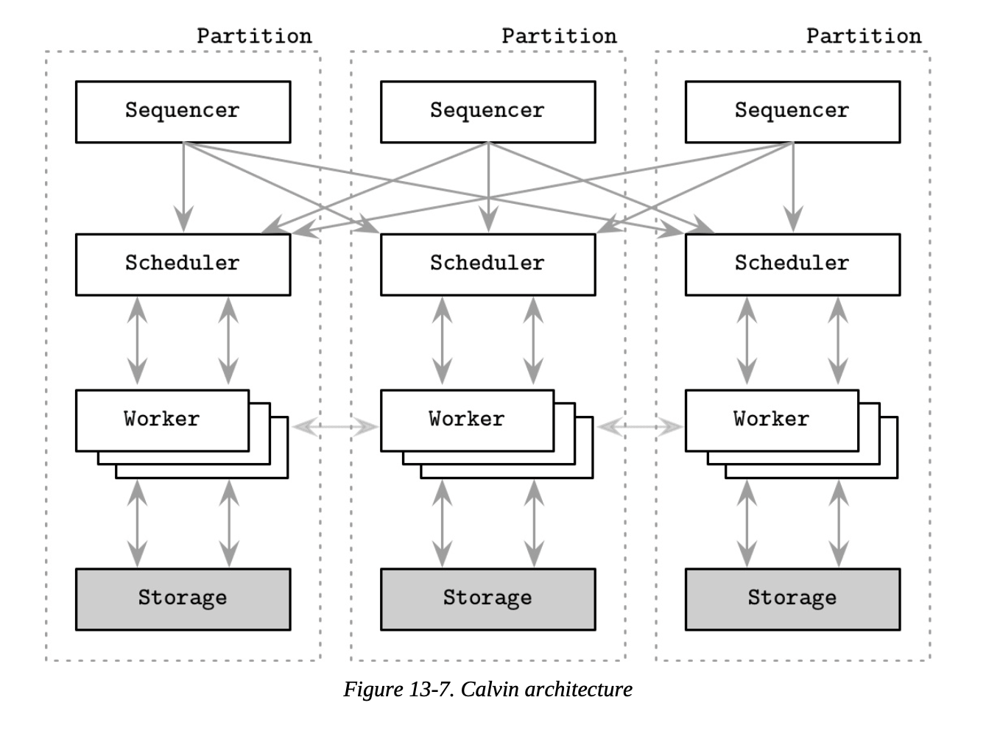
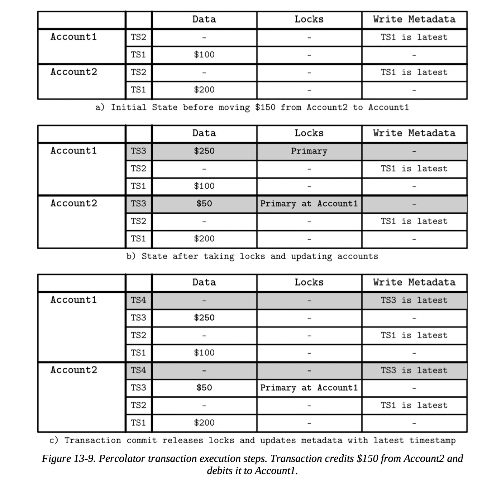

# 《数据库系统内幕》笔记

# 第一部分：存储引擎

本书既不是关于关系型数据库的书，也不是关于NoSql的书，而是关于各种数据库系统中使用的算法和概念的书，且重点是存储引擎和负责数据分布的组建

## 第一章. 简介与概述


### 数据类型

1. 内存数据库：主要讲数据存储在内存中，并使用磁盘进行数据恢复和日志记录
2. 磁盘数据库：将大部分数据保存在磁盘上，并使用内存来缓存磁盘内容作为临时存储。
3. 面向列的数据库：将数据按照列存储，同一列的数据连续存储在一起，数据具有相同的数据类型，提高了压缩率，跨多行扫描数据，在列的子集上进行聚合时比较有优势
4. 面向行的数据库：将数据按照行存储，同一行的数据连续存储在一起，数据具有较好的局部性，读取数据是需要整行读取。
5. 宽列是存储：数据表示为多维映射，列被分组为列族（通常存储相同类型的数据），并且在每个列族中，数据被逐行存储。此布局最是适合存储有一个键或者一组键类检索的数据


### 数据文件和索引文件

数据文件:

数据文件存储数据记录，文件被划分成页，每页具有单个或者多个磁盘块的大小，大多数现代存储系统都不显示的删除页上的数据，相反他们使用标记删除

索引文件:

是一种未来高效检索数据而对磁盘上的数据进行组织的结构，


## B数基础支持

1. 二叉搜索树
一个节点的键大于其左子树总存储的任何键，且小于其右子树中存储的任何键
2. 


# 第二部分：分布式系统

## 分布式系统面临的问题
1. 网络不可靠
	* 网络不可达
	* 链接中断
	* 请求到达，并处理，但是对端的响应丢失 
 	* 延迟不确定
2. 请求处理不是瞬时的
	+ 消息可能进入远程机器的队列中，等待被处理，
	+ 队列的大小取决于
3. 时钟不可靠
	+ 不同参与者的时钟不同步
	+ 时钟不一定单调递增
4. 服务端状态不一致
	+ 分布式算法不总是状态一致，异常数据，总是在被读取时修复或者冲突时解决
5. 本地和远程执行存在较大差异
6. 故障处理
	+ 总有其中的某个部分会出现问题
7. 网络分区和部分故障
8. 级联故障
	+ 某个部分的故障可能引起其他依赖方的故障，需要通过熔断，退避，验证和协调机制来保护

## 故障检测

负责识别故障或者无法到的进程，将它们排出在外，并在维护安全性的同时保证算法的活动性
>* 活动性：保证特定预期事件必须发生。比如，其中一个进程发生故障，则故障检测器必须检测到该故障。
>* 安全性：保证意外事件不会发生。比如，故障检测器已经将一个进程标记为死亡，那么这个进程必须是死亡的。

故障检测的难点在于如何将运行缓慢和故障区分开。

### 检测远程存活状态的办法：

1. ping：过向远端发送ping，并且等待远端回复的response，通过在指定时间内是否收到回复来判断其是否存活
2. 心跳：向对方发送心跳，主动通知对方，其仍在运行

### 无超时的故障检测

原理：

每个进程维护一个邻居列表，其中保存各邻居心跳计数。心跳包中包含一个传播路径，记录心跳途径的进程。邻居收到心跳包后，根据途径路径进程累加相应进程的心跳次数。最后，推断出心跳最少的邻居为故障进程。

```go
type map[neighborhood]hbCount HeartbeatList

type Heartbeat_msg struct {
	pass_path []string
	msg_id int64
}
```



步骤：

1. 每个进程维护一个邻居列表，其中保存个邻居心跳计数
2. 向邻居发送心跳消息，心跳消息中包含消息ID，和到目前为止途径的进程
3. 接收到消息时，根据消息的传播路径，增加相应邻居的心跳数。
4. 将心跳包发送给尚未参与的进程，并将自身追加到传播路径
5. 如果看到所有已知进程都已接消息，就停止传播消息
6. 检查心跳计数器，认为心跳最少的进程位故障进程

实现：

AGUILERA97

### 外包心跳

原理：

从相邻进程的角度来看进程的活动性，即，当心跳不通的时候，尝试通过其他节点中转心跳，如果中转心跳也不通，则认为故障



步骤：

1. p1向p2发送ping，p2没有回应
2. p1随机选择p3,p4向p2发送数据，如果p2响应，则将结果反馈给p1

实现

Scalable Weakly Consistent Infection-style Process Group Membership Protocol, SWIM

### phi增量故障检测器-cassandra,akka

原理:

步骤:

// todo


### Gossip和故障检测

原理:

维护一个包含所有成员的心跳列表，记录心跳次数和时间，定期更新自己的心跳次数和时间，并向邻居传播心跳列表，邻居收到列表之后，与本地列表合并保留最新值。最后，推断出长时间未更新心跳的成员为故障成员


```go
map[neaberhud]{hbTimes, hbTimestamp}

```




步骤:

1. 每个进程维护一个包好所有成员的列表，记录对应成员的心跳次数和心跳时间。
2. 每个成员定期递增自己的心跳次数和时间，并通过心跳消息将本地列表发送给随机的邻居
3. 成员收到心跳消息时，将消息中的列表与本地列表合并，最终保留各成员最近的心跳次数和心跳时间
4. 成员定期检查成员列表，在足够成的时间内没有更新过心跳次数的成员，被认为是鼓掌成员。

实现：

VANRENESSE98


## 选举

选举的过程中必须产生一个领导者，这一决定必须对所有参与者都有效。


### 霸道选举算法

原理:

给进程添加序号，通过选择最大序号的办法找到新的领导者

步骤:

1. 发现系统中没有领导者
2. 向所有比其具有更高标识符的进程发送选举消息
3. 从回应中，选择最大的标识符的进程作为领导者
4. 如果没有回应，选择自己作为领导者
5. 新的领导者，给所有具有更低标识符的进程发送通知

实现：

MOLINA82


### 带故障转移的霸道选举算法

原理:

试图解决由于最高排名的节点不稳定，导致领导者不稳定的情况。为领导者引入了故障转移节点，领导者故障时候，从故障转移节点中选择新的领导者

步骤:

1. 新的领导者提供一个故障转移节点（备选节点）的列表，
2. 当新的领导者出现故障时，发现者向备选节点发起新一轮选举
3. 如果发现这是备选节点中排名最高的节点，则它成为新的领导者

实现：

GHOLIPOUR09


### 候选节点/普通节点优化

原理:

试图解决由于最高排名的节点不稳定，导致领导者不稳定的情况，仅从领导者候选节点中选择领导者

步骤:

1. 将所有节点分成两个子集，候选节点和普通节点
2. 普通节点向候选节点发起选举请求
3. 收到候选节点的响应后，选择排名最高的最为候选节点作为新的领导者
4. 通知其余其余节点

实现：

MURSHED12


### 邀请算法

原理:

通过领导者之间的协商，按照大组合并小组的规则，合并形成一个大组，选出领导者

步骤:

1. 每个进程一开始都属于一个新组，并且是领导者，组内只有它自己
2. 组领导者邀请不属于该组的对等进程加入改组
3. 如果对方也是领导者，则两组合并，组大的领导者，成为新的领导者，并通知较小组的成员
4. 如果对方不是领导者，返回他们组领导者的ID
5. 最终所有组合并成了一个大组和一个领导者

实现：


### 环形算法

原理:

在环上传播选举消息，并筛选出来了活跃节点集合，从活跃节点集合中选择排名最高的作为领导者。

步骤:

1. 所有节点组成一个环，并且知道拓扑
2. 当发现领导者故障时，发起选举，选举消息沿着环向后继节点转发
3. 如果遇到后继节点不可用，则跳过此节点
4. 在转发选举消息的时候，将自己添加到活动节点集合，一并转发给后继节点
5. 当选举消息到达始发节点时，从活动节点集合中，选择排名最高的节点作为领导者
6. 沿着环通知其余节点


实现：

CHANG79


## 复制和一致性

todo

## 反熵和传播

熵表示节点之间分歧程度，反熵表示去除这种分歧程度的过程

### 传播的三个方法：

1. 点进程广播
2. 点对点交换
3. 合作广播





### 广播存在的问题：

1. 大集群中，广播会变得很昂贵
2. 存在单点故障
3. 各进程并不总是知道其他进程的存在
4. 广播的进程及其他每个进程都必须在工作时间上有重叠


### 反熵：

为了保持各节点的同步，反熵会触发一个后台和前台进程，比较和调和丢失或冲突的记录。
1. 后台进程会利用Merkle树之类的辅助数据结构，从更新日志中识别出来分歧的数据
2. 前台进程会稍带地在读取或者写入请求熵附加额外逻辑，比如提示移交，读修复等。


### 读修复

协调者向各副本发出读请求，等待副本响应并对其进行比较，如果检测出某个副本的数据不一致，然后将差异发送给该副本

### 摘要读

协调者只向一个副本发送完全读请求，向其他副本发送数据摘要（数据哈希值）读请求。如果某个副本的数据摘要不匹配，协调者向其发送完全读请求，比较它们的响应，找出差异之处，然后将差异发送给该副本

### 提示移交

向某个节点写入数据失败时，则记录一条特殊的记录，称为：提示（hit）。当这个节点恢复后，该记录会立刻被回放。

### Merkle树

Merkle树是一个对本地数据的紧凑的哈希表示，它是一颗由哈希值构成的二叉树。较高层级来自对较低层级的哈希值再次进行哈希。




通过比较树根节点的值，可以快速判断两个副本是否一致，通过递归遍历哈希树节点来缩小不一致的范围

### 位图版本向量

原理：

位图版本向量是由一个整数n表示前n项目连续，一些列bit表示第n项之后不连续的多项目构成，表示为（n, bit...)。例如（3，010101）表示前3项目连续，之后不连续，其中第4，6，8项缺失。




步骤：

1. 每个节点各维护一份所有节点的位图版本向量，以及各个节点的位图版本向量中不连续部分的更新日志
2. 写入请求（直接或间接）需要带有写入标识（i，n），表示节点n的第i次写入。
3. 收到写入请求后根据写入标识（i，n）更新相应节点的位图向量，
4. 在反熵时，通过交换为图版本向量，识别出来缺失的写入，然后复制与之关联的数据记录，
5. 如果所有节点维护的某个节点的位图版本向量的前x项已连续，则将此节点的位图版本向量的连续部分更新为x

实现：

GONCALVES15

### Gossip

todo


## 分布式事务

### 原子提交算法

原子提交算法不允许参与者之间出现分歧，只要一个参与者投票反对，事务就不能提交

协调者（领导者）：负责保存状态和收集投票，并作为协商的主要依据。领导者可以通过选主算法选出来，也可以通过手动配置确定。
参与者：每个参与者负责一个分区，并在这些数据上执行事务，投票接受或者拒绝协调者的提议，


### 2PC

协调者，参与者两端都会保存执行日志。协调者拥有一个定时器，用于检测参与者投票的超超时

1. 提议阶段：协调者发出提议，等待参与者投票
2. 提交/终止阶段：参与者仅仅反转开关，让第一阶段的结果可见





故障处理：
1. 如果某个参与者在提议阶段故障，协调者会触发超时中止事务
2. 如果某个参与者在接受提案之后故障，则在其恢复之后，要从协调者那里同步决策日志，完成协调者的最终决定
3. 如果协调者已经做出了决定，但是该决定未送达任何一个副本，就会出现未决状态。


### 3PC

相比2PC增加了准备阶段和参与者侧的超时。某个参与者的准备阶段已完成，表示它的事务可以提交。参与者侧的超时用于检测所有过程的整体超时，如果发现超时，参与者自行中止或者提交事务。

1. 提议阶段：协调者发出提议并收集投票
2. 准备阶段：协调者将投票结果通知给参与者，并等待所有参与者的确认
3. 提交阶段：协调者通知参与者提交事务，并重置参与者的超时计时器





故障处理：
1. 参与者侧的超时时间到达之后，参与者检测自身状态，如果已经完成准备过程，则提交事务，否则中止事务。


### Calvin分布式事务

是一种不使用原子提交的算法，所有，没有协调者和参与者。每个分区拥有一组定序器，调度器，执行器。事务的入口是所有的分区的定序器，定序器对输入的事务排序。定序器通过paxos算法达到对排序结果的共识，排序后的事务经过调度器调度在执行器上执行。

事务在执行器上执行过程：

1. 分析事务的读取集和写入集，确定读取集中的本地数据，创建活跃参与者的列表
2. 将本地数据转发给其他的活跃参与者
3. 接收其他执行器发来的数据
4. 执行事务。




优缺点：

- 优点：没有未决状态，不会出现脑裂
- 缺点：延迟较大


### Spanner分布式事务

todo

### Percolator分布式事务

是一种事务API，用不同的列保存数据记录，已提交的数据点位置，和锁信息。

每个事务必须和授时点通信两次，一次获取事务开始时间，另一次在提交过程中，写入回先被缓存起来，最后由客户端驱动进行两阶段提交。


- a)初始状态。执行完上一个事务后，TS1 是两个账户的最新时间戳。没有锁。
- b)第一个阶段称为预写(prewrite)。事务尝试为所有写人的单元格加锁。其中一个锁被标记为主(primary)锁，用于客户端恢复。事务会检查是否存在可能的冲突;是否存在其他事务已经用更晚的时间戳写人了数据，或者在任何时间戳下是否存在未释放的锁。如果检测到冲突则中止事务。
- c)如果成功获取了所有锁即排除了冲突的可能性，事务便可以继续执行。第二阶段中，客户端开始释放这些锁，首先释放主锁。它用写记录替换锁，通过该操作让写人对外可见，并更新写入元数据为最新数据点的时间戳。




### 协调避免

todo


## 共识

FLP不可能定理：对于完全异步系统，不可能确保在有限时间达成共识

正确的进程：如果一个进程没有崩溃，并且可以持续地执行算法步骤，我们就说该进程是正确的。

共识常被用于将时间按照特定顺序排列，并确保参与者之间的一致性。

共识算法的三个特性：

* 一致性：所有正确进程决定的值都相同
* 有效性：决定的值是由其中一个进程提议的
* 终止性：所有真确进程都最终会做出决定

### 广播

尽力而为广播：由发送方确保将消息传递给所有目标。如果失败，其他参与者不会尝试重新广播该消息，如果发送方失败，这种广播将静默地失败

洪泛广播：每个接收到消息的进程都会将消息转发给他所知道的其他进程，该方法有个缺点是，他用到了N^2条消息（N是剩余接收者的数量）


### 原子广播

原子广播也称全序广播，能够保证可靠传递和全序性。

原子广播的特性：

* 原子性：所有无故障的进程要么全都收到了消息，要么全都没有收到
* 有序性：所有无故障的进程均以相同的顺序收到消息

#### zookeeper原子广播（ZAB）

ZAB协议中有领导者和跟随者两种角色：领导者，负责驱动整个算法流程，广播消息给跟随者并建立事件顺序。数据写入和最新数据的读取请求有领导者来处理。领导者的选举可通过任意选举算法选举产生。

ZAB协议中时间线被分割成了epoch，具有唯一且单调递增的序号标识

选举产生的潜在领导者，通过以下步骤成为真的领导者，并履行相关职责：

* 发现阶段：完成新epoch的提议和确认。潜在领导了解其他进程的epoch，并提出一个更大的epoch，提议给跟随者，跟随者收到提议之后，回复前一个epoch中看到过的最新事物标识符。之后，跟随者不再接受更早epoch的广播提议
* 同步阶段：完成新领导者的提议和确认，以及数据同步。潜在领导者提议自己是新epoch的领导，收到跟随者的确认之后，确立成为了领导者，之后跟随者不再接受其他潜在领导者成为领导者的提议。新领导者确保各个跟随者拥有相同的历史记录，并将先前epoch领导者已提交的提案转发给跟随者
* 广播阶段：领导者接收客户端的消息，确定消息顺序，并提议给跟随者，等待quorum的跟随者确认，最后提交。


todo：pic

故障检测：通过心跳机制来检测故障。领导者未从quorum的跟随者那里收到心跳，会发起领导者选举。跟随者未存领导者收到心跳，也会发现领导者选举
有序性：在上一个消息确认之前，领导者不会尝试发送下一个消息


### Paxos

Paxos协议中的三个角色

* 提议者：从客户端接收值，创建提案，并尝试从接受者收集投票
* 接受者：投票接受或者拒绝提议，一般由多个接受者，主要quorum（大多数）的接受者投票接受，即可接受提案。
* 学习者：扮演副本的交恶，保存被接受的提案的结果

每个提案都有一个唯一单调递增的提案编号，通常用（节点id，timestamp）实现，用于确保操作的全序性。

#### Paxos算法

投票阶段：提议者竞争领导权
复制阶段：提议者将值分发给接受者


todo：pic

#### Multi-Paxos


#### 快速Paxos

todo

#### 平等Paxos

todo

#### 柔性Paxos

todo

### Raft
### 拜占庭共识


