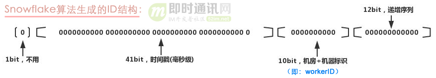
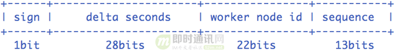

# 分布式id服务


<!-- MarkdownTOC autolink=true -->

- [全局唯一](#%E5%85%A8%E5%B1%80%E5%94%AF%E4%B8%80)
    - [UUID](#uuid)
- [全局唯一，趋势有序](#%E5%85%A8%E5%B1%80%E5%94%AF%E4%B8%80%EF%BC%8C%E8%B6%8B%E5%8A%BF%E6%9C%89%E5%BA%8F)
    - [SnowFlake](#snowflake)
    - [mysql自增id](#mysql%E8%87%AA%E5%A2%9Eid)
    - [美团Leaf-segment](#%E7%BE%8E%E5%9B%A2leaf-segment)
    - [滴滴Tinyid](#%E6%BB%B4%E6%BB%B4tinyid)
    - [百度UidGenerator](#%E7%99%BE%E5%BA%A6uidgenerator)
        - [DefaultUidGenerator](#defaultuidgenerator)
        - [CachedUidGenerator](#cacheduidgenerator)
- [全局唯一，局部有序](#%E5%85%A8%E5%B1%80%E5%94%AF%E4%B8%80%EF%BC%8C%E5%B1%80%E9%83%A8%E6%9C%89%E5%BA%8F)
    - [微信msgid](#%E5%BE%AE%E4%BF%A1msgid)
    - [美团Leaf-snowflake](#%E7%BE%8E%E5%9B%A2leaf-snowflake)

<!-- /MarkdownTOC -->


## 全局唯一
### UUID

UUID（Universally Unique Identifier）的标准型式包含32个16进制数字，以连字号分为五段，形式为8-4-4-4-12的36个字符，示例：550e8400-e29b-41d4-a716-446655440000，到目前为止业界一共有5种方式生成UUID，详情见IETF发布的UUID规范：[《A Universally Unique IDentifier (UUID) URN Namespace》](https://www.ietf.org/rfc/rfc4122.txt)。


**缺点**

- 不易于存储：UUID太长，16字节128位，通常以36长度的字符串表示，很多场景不适用；
- 信息不安全：基于MAC地址生成UUID的算法可能会造成MAC地址泄露，这个漏洞曾被用于寻找梅丽莎病毒的制作者位置。


## 全局唯一，趋势有序

趋势有序，是指较小的时间范围内看，可能不是递增的，但是在较大的时间范围内、总体上来看是递增的。

### SnowFlake

SnowFlake算法，是Twitter开源的分布式ID生成算法。其核心思想就是：使用一个64bit的 long型的数字作为全局唯一ID。


**实现方式**

这64个bit中，其中1个bit是不用的，然后用其中的41bit作为毫秒数，用10bit作为工作机器ID，12bit作为序列号。

SnowFlake的ID构成：


1. bit：是不用的，为啥呢？

    因为二进制里第一个bit为如果是1，那么都是负数，但是我们生成的ID都是正数，所以第一个bit 统一都是0。

2. 41bit：表示的是时间戳，单位是毫秒。

    41bit可以表示的数字多达2^41-1，也就是可以标识2^41-1个毫秒值，换算成年就是表示69年的时间。

3. 10 bit：记录工作机器 ID，代表的是这个服务最多可以部署在 2^10 台机器上，也就是1024 台机器。

    但是10bit里5个bit代表机房id，5个bit代表机器ID。意思就是最多代表2^5个机房（32个机房），每个机房里可以代表2^5个机器（32台机器）。

4. 12 bit：这个是用来记录同一个毫秒内产生的不同 ID。

    12 bit 可以代表的最大正整数是 2 ^ 12 - 1 = 4096，也就是说可以用这个 12 bit 代表的数字来区分同一个毫秒内的 4096 个不同的 ID。理论上snowflake方案的QPS约为409.6w/s，这种分配方式可以保证在任何一个IDC的任何一台机器在任意毫秒内生成的ID都是不同的。


**缺点**

强依赖机器时钟，如果机器上时钟回拨，会导致发号重复或者服务会处于不可用状态。


### mysql自增id

**原理**

利用给字段设置auto_increment_increment和auto_increment_offset来保证ID自增，每次业务使用下列SQL读写MySQL得到ID号。

```
# 创建表
CREATE TABLE `Tickets64` (
  `id` bigint(20) unsigned NOT NULL auto_increment,
  `stub` char(1) NOT NULL default '',
  PRIMARY KEY  (`id`),
  UNIQUE KEY `stub` (`stub`)
) ENGINE=InnoDB


# 获取新id
begin;
REPLACE INTO Tickets64 (stub) VALUES ('a');
SELECT LAST_INSERT_ID();
commit;

```

auto_increment_increment： 自增id增加的步长
auto_increment_offset：自增id的初始化值

REPLACE 的工作方式与 INSERT 完全相同，但如果表中的旧行与 PRIMARY KEY 或 UNIQUE 索引的新行具有相同的值，则在插入新行之前删除旧行。


**高可用**

可以部署多台mysql，每个服务以不同的初始值和相同的步长产生id

下面是部署两个mysql的例子：

```
TicketServer1:
auto-increment-increment = 2
auto-increment-offset = 1

TicketServer2:
auto-increment-increment = 2
auto-increment-offset = 2
```

**缺点**

- 系统水平扩展比较困难
- 数据库压力会成为瓶颈

**参考文档**

- <https://code.flickr.net/2010/02/08/ticket-servers-distributed-unique-primary-keys-on-the-cheap/>


### 美团Leaf-segment


**原理**

Leaf服务预先从db中获取一个号段，然后在内存中将此号段进行分配，Leaf可以部署多个，多个Leaf先后获取了不同的号段，所以，最总分配出的结果不是严格有序，而是趋势有序的。

数据库表设计如下：

|biz_tag|max_id|step|desc|update_time|
|-------|------|----|----|-----------|


重要字段说明：

```
biz_tag：用来区分业务；
max_id：表示该biz_tag目前所被分配的ID号段的最大值；
step：表示每次分配的号段长度。
```


Leaf获取号段的过程：

```
Begin
UPDATE table SET max_id=max_id+step WHERE biz_tag=xxx
SELECT tag, max_id, step FROM table WHERE biz_tag=xxx
Commit
```


**特点**


### 滴滴Tinyid

Tinyid是滴滴用Java开发的一款分布式id生成系统，基于数据库号段算法实现。


**原理**

数据库表设计如下：

|id|biz_type|max_id|step|delta|remainder|version|
|--|--------|------|----|-----|---------|-------|


如上表所示：

```
1）我们增加了biz_type，这个代表业务类型，不同的业务的id隔离；
2）max_id则是上面的end_id了，代表当前最大的可用id；
3）step代表号段的长度，可以根据每个业务的qps来设置一个合理的长度；
4）version是一个乐观锁，每次更新都加上version，能够保证并发更新的正确性 。
5) delta代表id每次的增量，表示，号段内分发的id的间隔
6) remainder代表余数，表示，号段内分发id的初始偏移
```

那么我们可以通过如下几个步骤来获取一个可用的号段：

```
A、查询当前的max_id信息：select id, biz_type, max_id, step, version from tiny_id_info where biz_type='test';
B、计算新的max_id: new_max_id = max_id + step；
C、更新DB中的max_id：update tiny_id_info set max_id=#{new_max_id} , verison=version+1 where id=#{id} and max_id=#{max_id} and version=#{version}；
D、如果更新成功，则可用号段获取成功，新的可用号段为(max_id, new_max_id]；
E、如果更新失败，则号段可能被其他线程获取，回到步骤A，进行重试。
```


**特点**

- 通过delta和remainder字段可以实现数据库的横向扩容，增强了系统的并发能力
- tinyid-client可以一次获取一批id，然后在本地自行分配，减轻了系统压力，提高对的qps


**参考资料**

<http://www.52im.net/thread-3129-1-1.html>


### 百度UidGenerator


#### DefaultUidGenerator


**原理**

对SnowFlake算法进行了改进，支持自定义时间戳、工作机器id和序列号等各部分的位数。




1. sign(1bit)：固定1bit符号标识，即生成的UID为正数。
2. delta seconds (28 bits)：当前时间，相对于时间基点"2016-05-20"的增量值，单位：秒，最多可支持约8.7年（注意：(a)这里的单位是秒，而不是毫秒！ (b)注意这里的用词，是“最多”可支持8.7年，为什么是“最多”，后面会讲）。
3. worker id (22 bits)：机器id，最多可支持约420w次机器启动。内置实现为在启动时由数据库分配，默认分配策略为用后即弃，后续可提供复用策略。服务每次启动时候
4. sequence (13 bits)：每秒下的并发序列，13 bits可支持每秒8192个并发（注意下这个地方，默认支持qps最大为8192个）。


服务启动的时候向mysql表WORKER_NODE中插入数据，使用数据的id作为workerid

```sql
CREATE TABLE WORKER_NODE
(
ID BIGINT NOT NULL AUTO_INCREMENT COMMENT 'auto increment id',
HOST_NAME VARCHAR(64) NOT NULL COMMENT 'host name',
PORT VARCHAR(64) NOT NULL COMMENT 'port',
TYPE INT NOT NULL COMMENT 'node type: ACTUAL or CONTAINER',
LAUNCH_DATE DATE NOT NULL COMMENT 'launch date',
MODIFIED TIMESTAMP NOT NULL COMMENT 'modified time',
CREATED TIMESTAMP NOT NULL COMMENT 'created time',
PRIMARY KEY(ID)
)
COMMENT='DB WorkerID Assigner for UID Generator',ENGINE = INNODB;
```


核心代码如下，几个实现的关键点：

```
a. synchronized保证线程安全；
b. 如果时间有任何的回拨，那么直接抛出异常；
c. 如果当前时间和上一次是同一秒时间，那么sequence自增。如果同一秒内自增值超过2^13-1，那么就会自旋等待下一秒（getNextSecond）；
d. 如果是新的一秒，那么sequence重新从0开始。
```


**特点**

- workerid是每次worker启动的时候，通过mysql产生，所以，workerid每次启动之后都不一样
- id分配过程中，会检查时钟是否回退，如果回退，则返回错误
- 因为workerid每次服务启动时候都是变的，所以，在服务退出之后、启动之前，时钟发生了变化，也不会导致产生重复的id
- 使用锁，降低了系统系能


#### CachedUidGenerator


CachedUidGenerator是DefaultUidGenerator的重要改进实现。它的核心利用了RingBuffer，它本质上是一个数组，数组中每个项被称为slot。CachedUidGenerator设计了两个RingBuffer，一个保存唯一ID，一个保存flag。RingBuffer的尺寸是2^n，n必须是正整数。

简要的小结一下，CachedUidGenerator方式主要通过采取如下一些措施和方案规避了时钟回拨问题和增强唯一性：

1. 自增列：CachedUidGenerator的workerId在实例每次重启时初始化，且就是数据库的自增ID，从而完美的实现每个实例获取到的workerId不会有任何冲突；
2. RingBuffer：CachedUidGenerator不再在每次取ID时都实时计算分布式ID，而是利用RingBuffer数据结构预先生成若干个分布式ID并保存；
3. 时间递增：传统的SnowFlake算法实现都是通过System.currentTimeMillis()来获取时间并与上一次时间进行比较，这样的实现严重依赖服务器的时间。而CachedUidGenerator的时间类型是AtomicLong，且通过incrementAndGet()方法获取下一次的时间，从而脱离了对服务器时间的依赖，也就不会有时钟回拨的问题（这种做法也有一个小问题，即分布式ID中的时间信息可能并不是这个ID真正产生的时间点，例如：获取的某分布式ID的值为3200169789968523265，它的反解析结果为{"timestamp":"2019-05-02 23:26:39","workerId":"21","sequence":"1"}，但是这个ID可能并不是在"2019-05-02 23:26:39"这个时间产生的）。


**参考资料**

- <http://www.52im.net/thread-2953-1-1.html>
- <https://www.jianshu.com/p/2f7f5994f0b4>
- <https://www.cnblogs.com/yeyang/p/10226284.html>

## 全局唯一，局部有序

局部有序是相对于全局有序来说的。局部有序是指，在某个维度内有序，比如，在用户纬度内有序，即，分配给某个用户的id可以保证有序

### 微信msgid

同一uid内有序

**实现原理**

如果要保证有序，那么id必须**同时**由一个机器来来产生。然而，这种情况下高可用的方案就得通过主从的方式来实现。


**数据结构**

分布式存储记录:

|uid|max_seq|
|---|------|

内存中记录:

|uid|max_seq|cur_seq|
|---|------|-------|

**实现过程**

1. 分配服务从持久化存储中分配到一个id段：
    - 读取存储中的max_seq，赋值给内存中的: cur_seq mem.seq_seq = store.max_seq;
    - 将存储中的max_seq增加一个step，然后赋值给内存中的max_seq: store.max_seq+=step; mem.max_seq=store.max_seq;
2. 分配服务再将id段中的id逐个分配：mem.cur_seq++
3. 用完id段之后，再回到第1步: mem.cur_seq==mem.max_seq


**高可用**

由于一个uid的seq只能同时被一个服务分配，那么，seq的请求是如何准确到达后台服务的呢？又是如何实现高可用的呢？


通过配置来控制分配服务负责哪些uid，并且在分配服务出现故障的时候，将他负责的uid转给其他的分配服务。分配服务加载uid和卸载uid的过程如下：

1. 分配服务需要服务uid，被写入到分布式存储中 
2. 分配服务启动时，读取其需要提供服务的uid
3. 分配服务运行过程中，定期读取配置：
    - 如果读取失败，则需要在n秒内停止服务；
    - 如何读取成功，而且配置比较上次有变化，需要立即卸载需要卸载的uid，加载新的uid，等待n秒之后给新的uid提供服务


uid对应的分配服务，可能发生变动，比如，主从切块，认为调整负载。那么这些情况下，seq的请求是如何准确到达后台服务的呢？

概括来说，就是使用类似http 302，redis moved，这种类似的方式，当请求的uid不是当前的分配服务负责时，分配服务会返回正确的uid路由表，客户端收到后在缓存下来。

引述一段原文的详细描述：

    这里通过在 Client 端内存缓存路由表以及路由版本号来解决，请求步骤如下：
    1）Client 根据本地共享内存缓存的路由表，选择对应的AllocSvr；如果路由表不存在，随机选择一台AllocSvr；
    2）对选中的 AllocSvr 发起请求，请求带上本地路由表的版本号；
    3）AllocSvr 收到请求，除了处理 sequence 逻辑外，判断 Client 带上版本号是否最新，如果是旧版则在响应包中附上最新的路由表；
    4）Client收到响应包，除了处理 sequence 逻辑外，判断响应包是否带有新路由表。如果有，更新本地路由表，并决策是否返回第1步重试。


**问题**

1. uid在切换分配服务对的时候有n秒服务不可用，怎么办？

    由于微信后台逻辑层存在重试机制及异步重试队列，小段时间的不可服务是用户无感知的，而且出现租约失效、切换是小概率事件，整体上是可以接受的

2. 等待n秒的原因是什么？

    等待n秒的意义，在于保证uid的老服务已经卸载了他，即使，他的老服务服务读取到最新的配置，老服务也会因为读取不到配置而终止服务。

3. 仲裁服务是如何认定一个分配服务不可用的？

    todo


**优化改进**

为了进一步优化存储的io的次数，可以做以下改进。多个uid共用一个max_seq的情况，多个uid中的任何一个用完id段之后，更新一次max_seq，其他的uid也随之使用这个最新的max_seq，不用再去单独更新，省去不少io的次数。


分布式存储记录:

|uid|shared_max_seq|
|---|------|

内存中记录:

|uid|shared_max_seq|cur_seq|
|---|------|-------|


**参考资料**

- <http://www.52im.net/thread-1998-1-1.html>
- <http://www.52im.net/thread-1999-1-1.html>


### 美团Leaf-snowflake

同一机器内有序

**原理**

严格来说，Leaf-snowflake方案是Twittersnowflake改进版，它完全沿用snowflake方案的bit位设计，即是“1+41+10+12”的方式组装ID号。

Leaf-snowflake在workid的配置和系统时间回退问题上做了一些优化

1. 通过zk的顺序持久节点生workerid，减少了workerid的维护成本
2. 启动前检查系统的时钟是否有回退，检查系统的时钟是否与其他的服务的时钟有较大差距，如果有，则终止服务启动。


**启动过程**

- 启动时读取zk的顺序节点中记录workerid和worker的系统时间
- 如果没有workerid，则以当前服务的ip:port做为key，写入zk顺序节点，得到workerid
- 检查服务当前时间是否小于worker时间，如果小于则，终止服务
- 在顺序节点中写入当前服务的系统时间
- 通过rpc访问其他服务获取其他服务的系统时间
- 检查 abs(系统时间-sum(time)/nodeSize) >= 阈值，如果大于，则终止服务
- 创建zk临时节点，并且每隔一段时间(3s)上报自身系统时间，写入临时节点


**参考资料**

- <http://www.52im.net/thread-2751-1-1.html>


