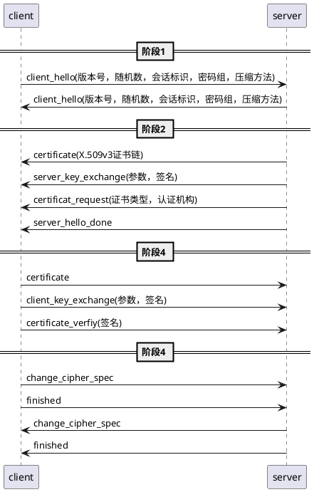

# https

## 17 传输层安全

### 17.2 传输层安全

#### 17.2.1 TLS体系结构

tls包括两层协议: 记录协议为上次提供了基本的安全服务，还有三个高层协议握手协议，修改密码规范协议协议，报警报警协议。心跳协议在独立的rfc中。

```
|-------------------------------------------|
|握手协议|修改密码规范协议|警报协议|http|心跳协议|
|-------------------------------------------|
|           记录协议                         |
|-------------------------------------------|
|            tcp                            |
|-------------------------------------------|
|            ip                             |
|-------------------------------------------|
```

两个重要的概念:

- 连接: 表示对等网络关系，且连接是短暂的，每个连接与一个会话相关
- 会话: 是一个客户端与一个服务端之间的关联，会话是通过握手协议建立的，定义了一组多个连接共享的密码安全参数


会话状态的参数:

- 会话表示
- 对整体证书
- 压缩方法
- 密码规范
- 主密钥
- 可恢复性

连接状态的参数:

- 服务器和客户端随机数
- 服务器写MAC密码
- 客户端写MAC密码
- 服务器写密钥
- 客户端写密钥
- 初始化向量
- 序列号


##### 记录协议

```
|1       |1       | 1      |2               | 
|--------|--------|--------|----------------|
|c_type  |m_ver   |s_ver   |cmpr_length     |
|-------------------------------------------|-------
| plaintext                                 |
|-------------------------------------------| cipher
| MAC(0, 16, or 20 bit)                     |
|-------------------------------------------|-------
c_type: 内容类型
m_ver: 主版本号
s_ver: 从版本号
cmpr_length: 压缩长度
```

主要处理过程:

应用数据 -> 分块 -> 压缩 -> 添加MAC -> 加密 -> 添加tls记录头 -> 写入tcp socket

每个步骤的细节:

todo


##### 握手协议

```
|1       |3                       |>=0      | 
|--------|------------------------|---------|
|type    |length                  |content  |
```

握手过程:




###### 阶段1: 建立安全功能

建立安全功能，包括协议版本，回话标识，密码套件，压缩方法和初始随机数


参数解释:

- 版本: 客户端所支持的最高tls版本
- 随机数: 由客户端客户端生成的随机数结构，用32位时间戳和一个由安全随机数生成器生成的28字节随机数组成
- 会话标识: 一个变长的会话标识，非0值表示，更新现有连接的参数，或为此会话创建一个新的连接，0值再次会话上创建新的连接
- 密码组: 按优先级到的降序排列的，客户端支持的密码算法列表，列表中的每个元素定义了一个密码交换算法和密码规格（ChiperSpec）

	密码交换算法包括：RSA，固定Diffie-Hellman，瞬时Diffie-Hellman，匿名Diffie-Hellman <br>
	密码规格包括：密码算法（RC4，RC2，DES，3DES，DES40，或者IDEA），MAC算法（MD5、SHA-1），密码类型（流、块），可否出口，散列长度，密钥材料，IV大小

- 压缩方法: 一个客户端支持的压缩方法列表


###### 阶段2: 服务认证和密钥交换：

服务端发送证书，密钥交换，请求证书，服务端发出问候，消息阶段结束信号


第二阶段中各个消息发送的条件：

- certificate: 使用了除匿名Diffie-Hellman意外的其他算法都需
- server_key_exchange:
	+ 无须：服务端发送包含固定Diffie-Hellman参数的证书，或者使用了RSA交换算法
	+ 必须：匿名Diffie-Hellman.....
	+ todo
- certificat_request: 如果服务端使用的不是匿名Diffie-Hellman算法，则服务端向客户端请求证书，
- server_hello_done: 始终都需要的一个消息，


###### 阶段3: 客户端认证和密钥交换：

如果服务端请求客户端发送证书，客户端发送密钥交换信息，客户端发送证书验证信息


如果需要，客户端应该验证服务端提供的证书是否有效，同时检查server_hello参数是否是可接受的。


第三阶段中各个消息发送的条件：

certificate: 如果服务端请求证书
client_key_exchange: 必须
certificate_verfiy:


###### 阶段4: 完成

改变密码套件，并结束握手协议


消息发条件:

client -> server: change_cipher_spec
client -> server: finished
server -> client: change_cipher_spec
server -> client: finished


##### 修改密码规范协议
```
|1       |
|--------|
|type    |
```


##### 警报协议
```
|1       |1       |
|--------|--------|
|layer   |alert   |
```


##### 心跳协议


## 抓包演示


## 参考文章

- 《密码编码学与网络安全》
- 《改变未来的九大算法》
- <https://hpbn.co/transport-layer-security-tls/>
- <https://zh.wikipedia.org/wiki/%E5%82%B3%E8%BC%B8%E5%B1%A4%E5%AE%89%E5%85%A8%E6%80%A7%E5%8D%94%E5%AE%9A>


