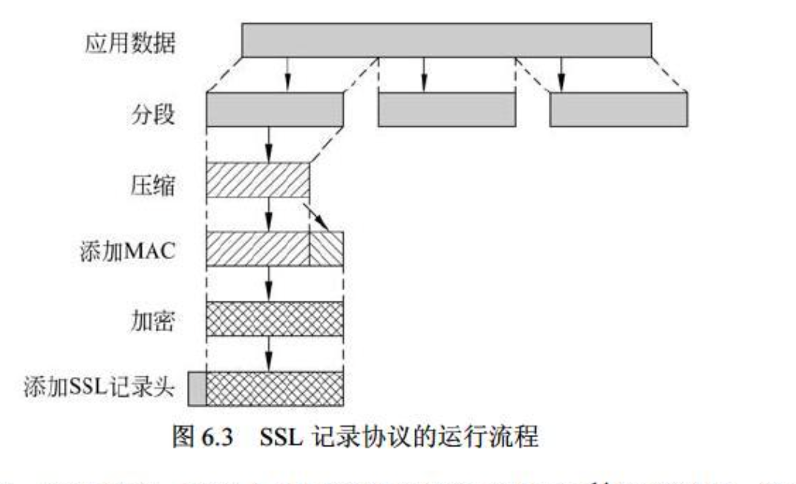
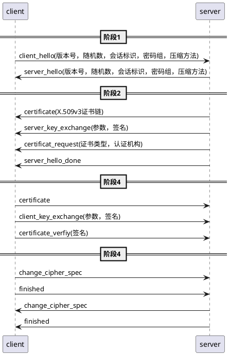

# TLS

<!-- MarkdownTOC autolink="true" -->

- [TLS体系结构](#tls%E4%BD%93%E7%B3%BB%E7%BB%93%E6%9E%84)
- [记录协议](#%E8%AE%B0%E5%BD%95%E5%8D%8F%E8%AE%AE)
- [握手协议](#%E6%8F%A1%E6%89%8B%E5%8D%8F%E8%AE%AE)
	- [阶段1: 建立安全功能](#%E9%98%B6%E6%AE%B51-%E5%BB%BA%E7%AB%8B%E5%AE%89%E5%85%A8%E5%8A%9F%E8%83%BD)
	- [阶段2: 服务认证和密钥交换：](#%E9%98%B6%E6%AE%B52-%E6%9C%8D%E5%8A%A1%E8%AE%A4%E8%AF%81%E5%92%8C%E5%AF%86%E9%92%A5%E4%BA%A4%E6%8D%A2%EF%BC%9A)
	- [阶段3: 客户端认证和密钥交换：](#%E9%98%B6%E6%AE%B53-%E5%AE%A2%E6%88%B7%E7%AB%AF%E8%AE%A4%E8%AF%81%E5%92%8C%E5%AF%86%E9%92%A5%E4%BA%A4%E6%8D%A2%EF%BC%9A)
	- [阶段4: 完成](#%E9%98%B6%E6%AE%B54-%E5%AE%8C%E6%88%90)
	- [主密钥的创建](#%E4%B8%BB%E5%AF%86%E9%92%A5%E7%9A%84%E5%88%9B%E5%BB%BA)
		- [第一步，交换预备主密钥:](#%E7%AC%AC%E4%B8%80%E6%AD%A5%EF%BC%8C%E4%BA%A4%E6%8D%A2%E9%A2%84%E5%A4%87%E4%B8%BB%E5%AF%86%E9%92%A5)
		- [第二步，双方计算主密钥:](#%E7%AC%AC%E4%BA%8C%E6%AD%A5%EF%BC%8C%E5%8F%8C%E6%96%B9%E8%AE%A1%E7%AE%97%E4%B8%BB%E5%AF%86%E9%92%A5)
	- [密码参数产生](#%E5%AF%86%E7%A0%81%E5%8F%82%E6%95%B0%E4%BA%A7%E7%94%9F)
- [修改密码规范协议](#%E4%BF%AE%E6%94%B9%E5%AF%86%E7%A0%81%E8%A7%84%E8%8C%83%E5%8D%8F%E8%AE%AE)
- [警报协议](#%E8%AD%A6%E6%8A%A5%E5%8D%8F%E8%AE%AE)
- [心跳协议](#%E5%BF%83%E8%B7%B3%E5%8D%8F%E8%AE%AE)
- [Diffie-Hellman](#diffie-hellman)
- [RSA](#rsa)
	- [公私钥的计算](#%E5%85%AC%E7%A7%81%E9%92%A5%E7%9A%84%E8%AE%A1%E7%AE%97)
- [证书](#%E8%AF%81%E4%B9%A6)
	- [证书链](#%E8%AF%81%E4%B9%A6%E9%93%BE)
- [抓包演示](#%E6%8A%93%E5%8C%85%E6%BC%94%E7%A4%BA)
- [参考文章](#%E5%8F%82%E8%80%83%E6%96%87%E7%AB%A0)
- [todo](#todo)

<!-- /MarkdownTOC -->


## TLS体系结构

tls由两层协议组成, 如下图所示：

记录协议为上层提供了基本的安全服务，握手协议，修改密码规范协议，报警报警协议，是记录协议之上的三个高层协议，心跳协议在独立的rfc中

```
|-------------------------------------------|
|握手协议|修改密码规范协议|警报协议| http|心跳协议|
|-------------------------------------------|
|           记录协议                         |
|-------------------------------------------|
|            tcp                            |
|-------------------------------------------|
|            ip                             |
|-------------------------------------------|
```


SSL协议中的两个重要概念是SSL会话和SSL连接，按照规范文件，它们的定义如下:

- 连接: 连接是一种能够提供合适服务类型(按照OSI分层模型定义)的传输。对 SSL来说，这种连接是点对点的关系而且都是短暂的。每一条连接都与一个会话相关联。
- 会话: SSL会话是客户与服务器之间的一种关联。会话是通过握手协议来创建的。所有会话都定义了密码安全参数集合，这些参数可以在多个安全连接之间共享。会话通常用来减少每次连接建立安全参数的昂贵协商费用。


会话状态由下列参数定义:
- 会话标识符: 由服务器产生的用于标识活动或可恢复的会话状态的一个任意字节序列。
- 对等实体证书: 对等实体的X509v3证书。会话状态的这一元素可以为空。
- 压缩方法: 加密前用于压缩数据的算法。
- 密码规格: 包括大块数据加密算法(例如空算法、AES算法等)规格和用于计算 MAC的散列算法(如MD5或SHA-1算法等)规格。它还定义了一些密码属性，例如散列值长度等。
- 主密钥: 客户端和服务器共享的48字节的会话密钥。
- 可恢复性: 表明会话是否可被用于初始化新连接的标志。


接状态由下列参数定义:
- 服务器和客户端随机数: 由服务器和客户端为每个连接选定的字节串。
- 服务器写MAC密钥: 服务器发送数据时用于计算MAC值的密钥。
- 客户端写MAC密钥: 客户端发送数据时用于计算MAC值的密钥。
- 服务器写密钥: 服务器用于加密数据、客户端用于解密数据的加密密钥。
- 客户端写密钥: 客户端用于加密数据、服务器用于解密数据的对称加密密钥。
- 初始化向量: 在CBC模式中，需要为每个密钥配置一个初始化向量(IV)。最初的 IV值由SSL的握手协议初始化。之后，每个记录的最后一个密码块被保存，以作为后续记录的IV。
- 序列号: 建立连接的各方为每条连接发送和接收的消息维护单独的序列号。当一方发送或接收改变密码规格的消息时，相应的序列号应置零。序列号的值不能超过2^64-1。


## 记录协议

```
|1       |1       | 1      |2               | 
|--------|--------|--------|----------------|
|c_type  |m_ver   |s_ver   |cmpr_length     |
|-------------------------------------------|-------
| plaintext                                 |
|-------------------------------------------| cipher
| MAC(0, 16, or 20 bit)                     |
|-------------------------------------------|-------
c_type: 内容类型
m_ver: 主版本号
s_ver: 从版本号
cmpr_length: 压缩后的长度
```

SSL记录协议为SSL连接提供如下两种服务:

- 机密性: 握手协议定义一个可以用于加密SSL载荷的传统加密共享密钥。
- 消息完整性: 握手协议还定义一个用于产生消息认证码(MAC)的共享密钥。

其内部处理流程：

应用数据 -> 分块 -> 压缩 -> 添加MAC -> 加密 -> 添加tls记录头 -> 写入tcp socket



MAC的计算方式：
```
hash(MAC_write_secret || pad_2 || 
	hash(MAC_write_secret || pad_1 || seq_num || 
	SSLCompressed.type ||
	SSLCompressed.length || SSLCompressed.fragment))

其中：
||=串接;
MAC_write_secret=共享密钥;
hash=散列算法(MD5或SHA-1);
pad_1=字节0x36(00110110)的重复。对MD5算法重复48次(384比特)，对SHA-1算法重复40次(320比特);
pad_2=字节0x5C(01011100)的重复。对MD5算法重复48次，对SHA-1算法重复40次;
seq_num=消息的序列号;
SSLCompressed.type=处理当前数据块的高层协议; SSLCompressed.length=压缩后数据块的长度;
SSLCompressed.fragment=压缩后的数据块(如果没有进行压缩，则为明文块)。

```


## 握手协议

```
|1       |3                       |>=0      | 
|--------|------------------------|---------|
|type    |length                  |content  |
```

握手协议是SSL最复杂的部分。这一协议允许客户端和服务器相互认证，并协商加密和MAC算法，以及用于保护数据使用的密钥通过SSL记录传送。

握手过程:




### 阶段1: 建立安全功能

双方共享双方功能集

参数解释:

- 版本: 客户端所支持的最高tls版本
- 随机数: 由客户端客户端生成的随机数结构，用32位时间戳和一个由安全随机数生成器生成的28字节随机数组成
- 会话标识: 一个变长的会话标识，非0值表示，更新现有连接的参数，或为此会话创建一个新的连接，0值再次会话上创建新的连接
- 密码套件: 按优先级到的降序排列的，客户端支持的密码算法列表，列表中的每个元素（即每个密码套件）定义了一个密钥交换算法和密码规格（ChiperSpec），下文详细描述。
- 压缩方法: 客户端支持的压缩方法列表


密钥交换算法包括：

- RSA: 客户端使用服务端的RSA公钥加密的密钥，然后发送给服务端，服务端用私钥解密得到密钥。

- 固定Diffie-Hellman: 这是一个Diffie-Hellman密钥交换过程，其中服务器证书中包含的公钥参数由认证机构(Certificationauthority，CA)签发。也就是说，公钥证书包含Diffie-Hellman公钥参数。客户端可以通过证书提供其公钥参数(如果需要对客户端认证)，也可以通过密钥交换消息提供其公钥参数。使用固定的公钥参数和Diffie-Hellman算法进行计算将导致双方产生固定密钥。 // todo hd的公钥参数如何存储，// todo：是否需要客户端的证书，客户端的证书从哪里来

>双方都在证书中放置Diffie-Hellman的公钥，通过证书交换完成Hellman公钥的交换，这样带来的问题是：双方都在证书中放置Diffie-Hellman公私钥都是固定的，导致计算出来的共享密钥也是相同，存在共享密钥的泄漏的风险

- 暂态Diffie-Hellman: 这种技术用于创建暂态(临时或一次性)密钥。在这种情况下，Diffie-Hellman公钥通过使用发送者的RSA私钥或DSS密钥的方式被交换和签名。接收者可以用相应的公钥验证签名。证书用于认证公钥。这种方式似乎是三种 Diffie-Hellman密钥交换方式中最安全的一种，因为它最终将获得一个临时的、被认证的密钥。

>发送者对暂态Diffie-Hellman公钥用RSA的私钥签名，然后交换，接收者用RSA公钥验证签名

- 匿名Diffie-Hellman(Anonymous Diffie-Hellman): 使用基本Diffie-Hellman密钥交换方案，且不进行认证。也就是说，双方发送自己的Diffie-Hellman参数给对方且不进行认证。这种方法容易受到“中间人攻击法”的攻击，其中攻击者与双方都进行匿名Diffie-Hellman密钥交换。

>直接交换Diffie-Hellman公钥，存在中间人攻击的风险

- Fortezza: 这种技术专为Fortezza方案而定义。


密码规格包括以下域:

- 密码算法: 可以是前面提到的算法中的任何一种: RC4、RC2、DES、3DES、DES40、IDEA或Fortezza。
- MAC算法: MD5和SHA-1。
- 密码类型: 流密码或分组密码。
- 可否出口: 可以或不可以。
- 散列长度: 016(用于MD5)或20(用于SHA-1)字节。
- 密钥材料: 字节序列(其中包含用于产生写密钥的数据)。
- IV大小: 密码分组连接(CBC)加密模式中初始向量的大小。


### 阶段2: 服务认证和密钥交换：

服务端发送证书，密钥交换数据，请求证书，最后发送hello消息阶段的结束信号

各个消息用途说明：

- certificate(X.509v3证书链)：向客户端发送证书，使用匿名Diffie-Hellman算法的情况不需要此过程
- server_key_exchange(参数，签名)：密钥交换，使用固定Diffie-Hellman，或者RSA算法的情况不需要此过程，参数和签名下文详细描述
- certificat_request(证书类型，认证机构)：请求客户端证书，使用匿名Diffie-Hellman算法的情况不需要此过程，证书类型指定了公钥算法及用法
- server_hello_done：服务端的hello及相应消息已经结束


server_key_exchange的参数：
- 匿名Diffie-Hellman: 消息由两个全局Diffie-Hellman密钥值(一个素数和它的一个本原根)，以及一个服务器公钥组成。
- 暂态Diffie-Hellman: 消息内容由三个Diffie-Hellman参数和一个对这些参数的签名组成。
- RSA密钥交换，服务器在使用RSA时仅用了RSA签名密钥，因此，客户端不能简单地通过服务器公钥加密其密钥后传送，而服务器必须创建一个临时RSA公钥/私钥对，并使用服务器密钥交换消息发送公钥。消息内容包含两个临时的RSA公钥参数(指数和模)和参数签名。 // todo
- Fortezza。 // todo


server_key_exchange的签名：

```
Hash(ClientHello.random || ServerHello.random || ServerParams)
```

### 阶段3: 客户端认证和密钥交换：

客户端检查服务端的证书是有效，检查server_hello中的参数是否可接受，如果服务端请求客户端发送证书，客户端发送密钥交换信息，计算主密码，客户端发送证书验证信息

- certificate：日过收到服务端请求（certificat_request）则发送该消息，如果没有合适的证书发送no_certificate_alert
- client_key_exchange(参数，签名)：密钥交换，消息内容见下文
- certificate_verfiy(签名)：证书验证，方便服务端对客户端证书进行显示验证，使用固定Diffie-Hellman的情况不需要此过程，


client_key_exchange的参数：

- RSA: 客户端产生一个48字节的pre_master_secret(预备主密钥)，并用从服务器证书中得到的公钥或者用从server_key_exchange消息中得到的RSA临时密钥进行加密。如何利用它计算主密钥将会在后面进一步解释。
- 暂态或匿名Diffie-Hellman: 发送客户端的Diffie-Hellman公钥参数。
- 固定Diffie-Hellman: 以certificate消息的形式发送客户端的Diffie-Hellman公钥参数，该消息内容为空。
- Fortezza: 发送客户端的Fortezza参数。

certificate_verfiy的签名：

```
Certificate.Verify.signature.md5_hash=MD5(master_secret || pad_2 || MD5(handshake_messages || master_secret || pad_1));

Certificate.Verify.signature.sha_hash=SHA(master_secret || pad_2 || SHA(handshake_messages || master_secret || pad_1));

如果用户的私钥是DSS，则使用md5_hash
如果用户的私钥是RSA，则使用md5_hash || sha_hash
```

其中:

- pad_1和pad_2是前面讲过的用于MAC计算的填充值;
- handshake_message(握手消息)是客户端启动clienthello时发送或接收到的所有握手协议消息，但不包括client_hello消息本身;
- master_secret(主密钥)是一个计算得到的密钥值，其计算过程稍后讲述。


### 阶段4: 完成

切换密码套件，并结束握手协议

```plantuml
client -> server: change_cipher_spec：修改密码规格，并把挂起的密码规格复制到当前的密码规格中，该消息使用更改密码规格协议发送
client -> server: finished：验证密钥交换和认证过程是否成功
server -> client: change_cipher_spec
server -> client: finished
```

finished消息的内容使用下面两个散列值的连接串：

```
MD5(master_secret || pad_2 || MD5(handshake_messages || Sender || master_secret || pad_1));
SHA(master_secret || pad_2 || SHA(handshake_messages || Sender || master_secret || pad_1))
```

其中:

- Sender是一个识别码，它能够把作为发送者的客户端与handshake_messages区分开来。
- handshake_messages包括从所有握手消息起到Sender码之前的所有数据，但不包括本条消息。


### 主密钥的创建

共享主密钥是通过密钥交换的方式，为会话创建的一个一次性48字节(384比特)的值。创建过程分两步完成:

#### 第一步，交换预备主密钥:

包括以下两种交换方式:

- RSA: 客户端产生一个48字节的预备主密钥，并使用服务器的RSA公钥加密，然后将其发送给服务器。服务器使用自己的私钥解密以得到pre_master_secret(预备主密钥)。
- Diffie-Hellman: 服务器和客户端各自产生一个Diffie-Hellman公钥值。交换之后，双方再分别做Diffie-Hellman计算来创建共享的预备主密钥。现在，客户和服务器都按照下面方法计算主密钥:


#### 第二步，双方计算主密钥:

```
Master_secret=MD5(pre_master_secret || SHA('A' || pre_master_secret || ClientHello.random || ServerHello.random)) ||
			MD5(pre_master_secret || SHA('BB' || pre_master_secret || ClientHello.random || ServerHello.random)) ||
			MD5(pre_master_secret || SHA('CCC’ || pre_master_secret || ClientHello.random || ServerHello.random))
```


### 密码参数产生

密码规格中参数，是由主密钥通过散列函数计算产生的，完成下列参数的计算：

- 客户端写MAC值的密钥
- 服务器写MAC值的密钥
- 客户端写密钥
- 服务器写密钥
- 客户端写初始向量IV
- 服务器写初始向量IV

计算方法类似于通过主预备密钥计算主密钥的过程：

```
keyblock=MD5(master_secret || SHA('A' || master_secret || ServerHello.random || ClientHello.random)) ||
		MD5(master_secret || SHA('BB' || master_secret || ServerHello.random || ClientHello.random)) ||
		MD5(master_secret || SHA('CCC’ || master_secret || ServerHello.random || clientHello.random)) || ...
```

该计算过程一直持续到产生足够长的输出。结果相当于一个伪随机数。主密钥可以认为是伪随机函数的种子值。


## 修改密码规范协议
```
|1       |
|--------|
|type    |
```


该协议的唯一功能是使得挂起状态改变为当前状态，用于更新当前连接使用的预报密码套件。


## 警报协议

```
|1       |1       |
|--------|--------|
|layer   |alert   |
```


- layer: 表示消息的严重程度，
	+ 警告(1)
	+ 致命(2)。出现致命错误，会立即结束当前连接，新连接不允许建立，已存在的连接不受影响 
- alert: 指明具体警告的编码，包括以下这些:
	+ 非预期消息: 接收到不恰当的消息。
	+ MAC记录出错: 接收到不正确的MAC码。
	+ 解压缩失败: 解压缩函数接收到不恰当的输入(例如，不能解压缩或解压缩后的数据大于允许的最大长度)。
	+ 握手失败: 发送者在可选范围内不能协商出一组可接受的安全参数。
	+ 不合法参数: 握手消息中的域超出范围或与其他域不一致。其他警报消息如下:
	+ 结束通知: 通报接收者，发送者在本次连接上将不再发送任何消息。连接双方中的一方在关闭连接之前都应该给对方发送这样一条消息。
	+ 没有证书: 如果没有合适的证书可用时，发送这条消息作为对证书请求者的回应。
	+ 证书不可用: 接收到的证书不可用(例如包含的签名无法通过验证)。
	+ 不支持的证书: 不支持接收到的证书类型。
	+ 证书作废: 证书已被签发者吊销。
	+ 证书过期: 证书已过期。
	+ 未知证书: 处理证书过程中引起的其他未知问题，导致该证书无法被系统识别和接受。


## 心跳协议


## Diffie-Hellman

## RSA
### 公私钥的计算

## 证书
### 证书链

## 抓包演示

## 参考文章

-《网络安全基础：应用与标准》  
- 《密码编码学与网络安全》  
- <https://hpbn.co/transport-layer-security-tls>  
- <https://zh.wikipedia.org/wiki/%E5%82%B3%E8%BC%B8%E5%B1%A4%E5%AE%89%E5%85%A8%E6%80%A7%E5%8D%94%E5%AE%9A>    


## todo

子标题需要重新排版

密码规格中的细节

机密性，完整性，认证性
